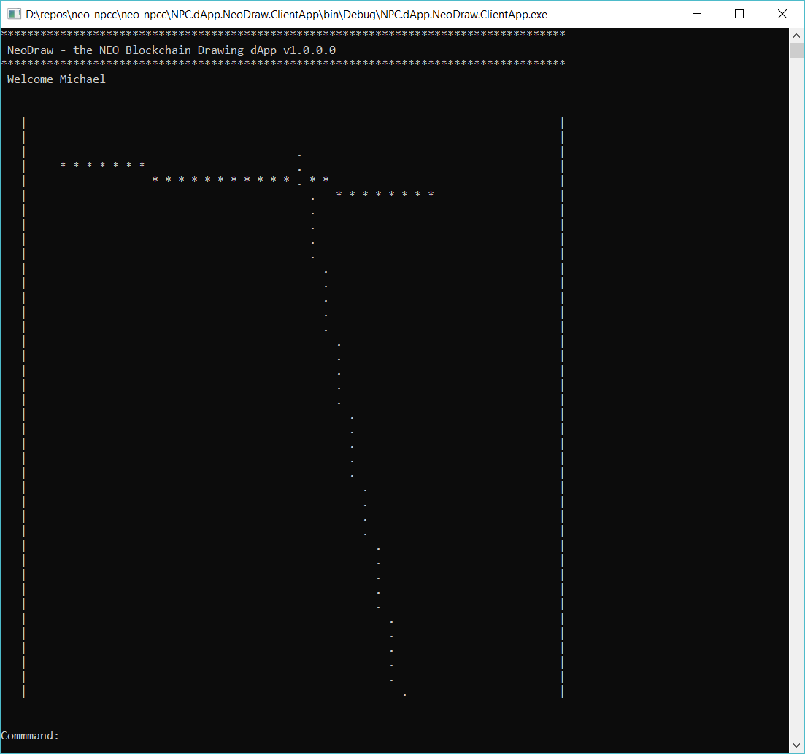

# NeoDraw - NEO Multi-Person Drawing dApp

**Reference dApp for the NEO Persistable Classes (NPC) Entity-oriented dApp (edApp) Platform v1.0**

`NeoDraw` is advanced proof-of-concept distributed application (dApp) for the NEO Persistable Classes (NPC) Entity-oriented dApp (edApp) Platform running on the NEO Blockchain. 

As a [`neo-csharpcoe`](https://github.com/mwherman2000/neo-csharpcoe/blob/master/README.md) compliant platform, the `NPC-edApp` platform includes a full suite of tools and libraries (code), frameworks, how-to documentation, and best practices for full-stack edApp development using .NET/C#, C#.NEO, and the NEO Blockchain:

* NPC Framework
* NPC Entity and Domain Model
* NPC Structured Storage Architecture (Nested Storage Domains)
* NPC NeoStorageKey Specificaton
* NPC Entity-oriented Programming Model
* NPC C#.NPC Entity Programming Language (EPL)
* NPC C#.NPC Compiler (npcc)
* NPC Source-level Execution Cost Profiler
* NPC Integrated Entity Tracing
* NPC Smart-formatting Event Log Views

[NEO Blockchain C# Center of Excellence](https://github.com/mwherman2000/neo-csharpcoe/blob/master/README.md) ([`neo-csharpcoe`](https://github.com/mwherman2000/neo-csharpcoe/blob/master/README.md))

The `neo-csharpcoe` project is an "umbrella" project for several initiatives related to providing tools and libraries (code), frameworks, how-to documentation, and best practices for full-stack development using .NET/C#, C#.NEO and the NEO Blockchain.

The `neo-csharpcoe` is an independent, free, open source project that is 100% community-supported by people like yourself through your contributions of time, energy, passion, promotion, and donations. To learn more about contributing to the `neo-csharpcoe`, click [here](https://github.com/mwherman2000/neo-csharpcoe/blob/master/CONTRIBUTE.md).

## NPC Framework

This edApp was developed with the `neo-csharpcoe` [Neo Persistable Classes (NPC) Framework]((https://github.com/mwherman2000/neo-persistableclasses/blob/master/README.md)>) including full automatic code generation of the NEO Persistable Classes using the [NPC Compiler (npcc)](https://github.com/mwherman2000/neo-npcc/blob/master/README.md).

## NeoDraw Smart Contract Protocol

* `add    user  [encodedusername, encodedpassword]`
* `get    user  [encodedusername]`
* `add    point [encodedusername, x, y]`
* `getall point [encodedusername]`
* `delete point [encodedusername]`

## NeoDraw Client App Commands

* `add    point x y`
* `delete point`
* `get    user`
* `help`
* `exit`

## NeoDraw Client App

