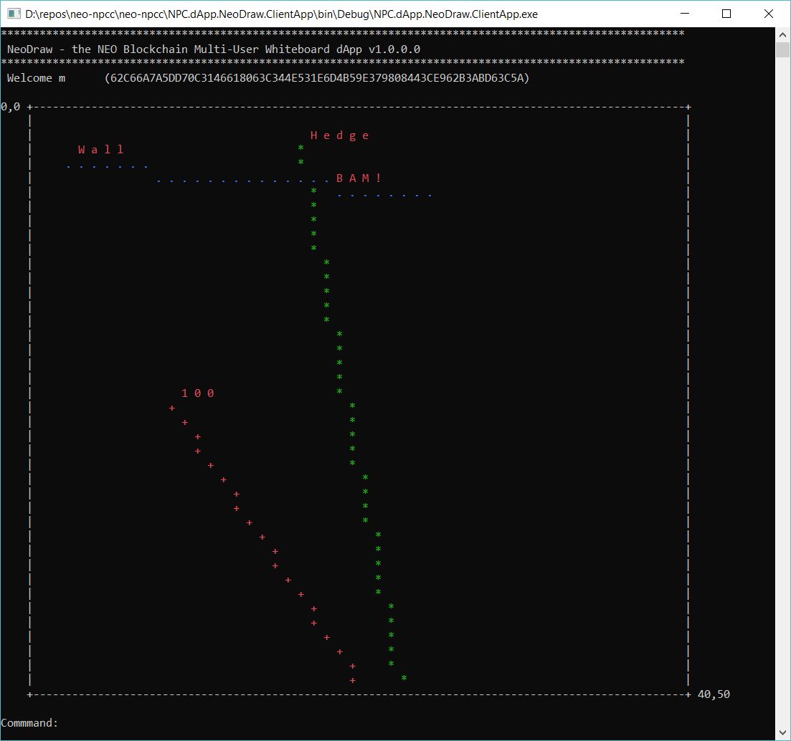

# NeoDraw - NEO Multi-Person Shared Whiteboard dApp

**Reference dApp for the NEO Persistable Classes (NPC) Entity-based dApp (e-dApp) Platform 2.0** 

`NeoDraw` is advanced proof-of-concept distributed application (dApp) for the NEO Persistable Classes (NPC) Entity-based dApp (e-dApp) Platform running on the NEO Blockchain. 

As a [`neo-csharpcoe`](https://github.com/mwherman2000/neo-csharpcoe/blob/master/README.md) compliant platform, the `NPC e-dApp` platform includes a full suite of tools and libraries (code), frameworks, how-to documentation, and best practices for enterprise application e-dApp development using .NET/C#, C#.NEO, and the NEO Blockchain:

| Component | Home Project |
| --------- | ------------ |
| NPC Framework | [neo-persistableclasses](https://github.com/mwherman2000/neo-persistableclasses) |
| NPC Entity and Domain Model | [neo-persistableclasses](https://github.com/mwherman2000/neo-persistableclasses) |
| NPC Structured Storage Architecture | [neo-persistableclasses](https://github.com/mwherman2000/neo-persistableclasses) |
| NPC NeoStorageKey Specificaton | [neo-persistableclasses](https://github.com/mwherman2000/neo-persistableclasses) |
| NPC Entity Programming Model | [neo-npcc](https://github.com/mwherman2000/neo-npcc) |
| NPC C#.NPC Entity Programming Language | [neo-npcc](https://github.com/mwherman2000/neo-npcc) |
| NPC C#.NPC Compiler (npcc) | [neo-npcc](https://github.com/mwherman2000/neo-npcc) |
| NPC Source-level Execution Cost Profiler | merged into [neo-debugger-tools](https://github.com/CityOfZion/neo-debugger-tools) |
| NPC Integrated Entity Tracing | [neo-npcc](https://github.com/mwherman2000/neo-npcc) |
| NPC Smart-formatting Event Log Views | merged into [neo-gui-developer](https://github.com/CityOfZion/neo-gui-developer) and [neo-debugger-tools](https://github.com/CityOfZion/neo-debugger-tools) |
| NPC JSON Entity Deserialization | [merged into neo-lex](https://github.com/CityOfZion/neo-lux/pull/9) |
| NPC NEO-KONG (Key-Object Notation for Geeks) Specification | [neo-persistableclasses](https://github.com/mwherman2000/neo-persistableclasses) |

[NEO Blockchain C# Center of Excellence](https://github.com/mwherman2000/neo-csharpcoe/blob/master/README.md) ([`neo-csharpcoe`](https://github.com/mwherman2000/neo-csharpcoe/blob/master/README.md))

The `neo-csharpcoe` project is an "umbrella" project for several initiatives related to providing tools and libraries (code), frameworks, how-to documentation, and best practices for full-stack development using .NET/C#, C#.NEO and the NEO Blockchain.

The `neo-csharpcoe` is an independent, free, open source project that is 100% community-supported by people like yourself through your contributions of time, energy, passion, promotion, and donations. To learn more about contributing to the `neo-csharpcoe`, click [here](https://github.com/mwherman2000/neo-csharpcoe/blob/master/CONTRIBUTE.md).

## NPC Framework

This e-dApp was developed with the `neo-csharpcoe` [Neo Persistable Classes (NPC) Framework]((https://github.com/mwherman2000/neo-persistableclasses/blob/master/README.md)>) including full automatic code generation of the NEO Persistable Classes using the [NPC Compiler (npcc)](https://github.com/mwherman2000/neo-npcc/blob/master/README.md).

## NeoDraw Smart Contract Protocol

* `add    user  [encodedusername, encodedpassword]`
* `get    user  [encodedusername]`
* `add    point [encodedusername, x, y]`
* `getall point [encodedusername]`
* `delete point [encodedusername]`

## NeoDraw Client App Commands

* `add    point x y`
* `help`
* `exit`

## NeoDraw Client e-dApp

### How run NeoDraw

NeoDraw is a Windows desktop application that was developed and tested with Windows 10 Professional.  It's fairly simply in terms of its outward construction - it should run almost anywhere except on a Mac ;-).

1. Download the [NPC.dApp.NeoDraw.ClientApp.exe.zip](https://github.com/mwherman2000/neo-npcc/blob/master/neo-npcc/NPC.dApp.NeoDraw.ClientApp/NPC.dApp.NeoDraw.ClientApp.exe.zip) ZIP archive file from [here](https://github.com/mwherman2000/neo-npcc/blob/master/neo-npcc/NPC.dApp.NeoDraw.ClientApp/NPC.dApp.NeoDraw.ClientApp.exe.zip_).

2. It will likely end up in your Downloads folder. Unzip it there (or wherever you'd like to extract the ZIP archive).

The files in this ZIP archive file are simply the contents of the `bin/Debug` folder for the [NeoDraw client e-dApp project](https://github.com/mwherman2000/neo-npcc/tree/master/neo-npcc/NPC.dApp.NeoDraw.ClientApp) located [here](https://github.com/mwherman2000/neo-npcc/tree/master/neo-npcc/NPC.dApp.NeoDraw.ClientApp).

3. Locate the `NPC.dApp.NeoDraw.ClientApp.exe` in the extraced collection of files.

4. Double-click `NPC.dApp.NeoDraw.ClientApp.exe` to open it and start it up.

5. You will be prompted for:
* Username
* Password
* Secret phrase

Use anything except single characters (I've used most of the alphabet already during testing).

**NOTE:* Don't use any of your regular usernames or passwords.  There's no need to.  All usernames and passwords are stored in the NeoDraw User Directory as SHA256 digital signatures.  It will be difficult to track anything you do in NeoDraw back to youself.

6. Once you're logged in, some scenery will be displayed: a Wall and a Hedge.  This is just part of the NeoDraw app.

7. However, the "User 100" points and vectors are being replayed from the block chain.  Everyone gets to see what User 100 has drawn on the shared whiteboard.

**NOTE:** In the future, this capability will be replaced with an "Add a Friend" command to playback the drawings created by anyone who will tell you their userid.  There is no way to hack NeoDraw to find out what another person's username or passord or secret phrase is.  They're hashed and except for your usename, are thrown away almost right away.

8. The only command that is currently activitated is: `add x y` where `0 < X < 50` and `0 < Y < 40`.

Enjoy and have fun but importantly begin to imagine the impact that a platform like `NPC-e-dApp` is going to have on global blockchain e-dApp development.

Best regards,

Michael Herman (Toronto)

E: neotoronto@outlook.com

T: (416) 524-7702

p.s. What would you like to build with NPC? I'm building [this](https://www.youtube.com/watch?v=M86okhXTwfU).

