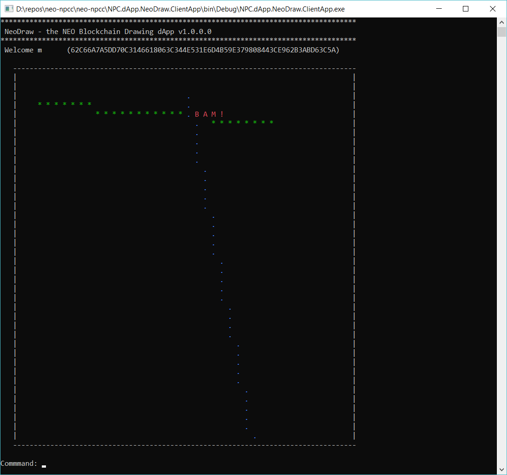

# NeoDraw - the NEO Blockchain Drawing dApp

[NEO Blockchain C# Center of Excellence](https://github.com/mwherman2000/neo-csharpcoe/blob/master/README.md)

The `neo-csharpcoe` project is an "umbrella" project for several initiatives related to providing tools and libraries (code), frameworks, how-to documentation, and best practices for full-stack development using .NET/C# and C#.NEO and the NEO Blockchain software platform.

The `neo-csharpcoe` is an independent, free, open source project that is 100% community-supported by people like yourself through your contributions of time, energy, passion, promotion, and donations. To learn more about contributing to the `neo-csharpcoe`, click [here](https://github.com/mwherman2000/neo-csharpcoe/blob/master/CONTRIBUTE.md).

## NEO Persistable Class (NPC) Framework

This dApp was developeed with the `neo-csharpcoe` [Neo Persistable Classes (NPC) Framework]((https://github.com/mwherman2000/neo-persistableclasses/blob/master/README.md)>) including full utomatic code generation of the NEO Persistable Classes using the [NPC Compiler (npcc)](https://github.com/mwherman2000/neo-csharpcoe/blob/master/README.md).

## NeoDraw Smart Contract Protocol

* `add    user  [encodedusername, encodedpassword]`
* `get    user  [encodedusername]`
* `add    point [encodedusername, x, y]`
* `delete point [encodedusername]`
* `getall point [encodedusername]`

## NeoDraw Client App Commands

* `get    user`
* `add    point x y`
* `delete point`
* `help`
* `exit`

## NeoDraw Client App

