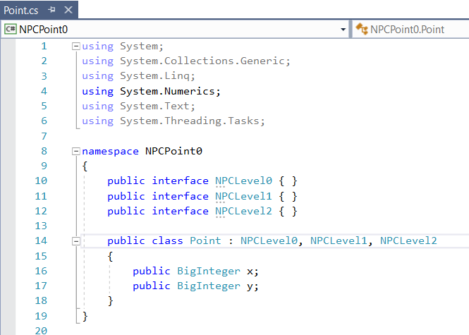
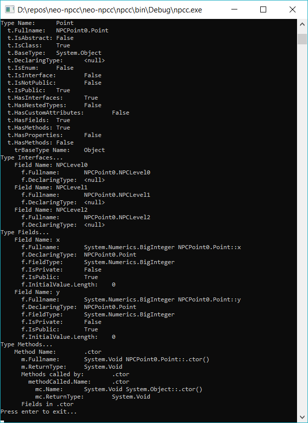

# neo-npcc
NEO Persistable Class Compiler (npcc) - Auto-generation of NPC Class implementations based on desired NPC Levels

CURRENT NPC V2.0 PROJECT can be found [here](https://github.com/mwherman2000/neo-persistableclasses/edit/master/README.md) ([https://github.com/mwherman2000/neo-persistableclasses/edit/master/README.md](https://github.com/mwherman2000/neo-persistableclasses/edit/master/README.md)).

PREVIOUS NPC V1.0 PROJECT can be found [here](https://github.com/mwherman2000/neo-persistibleclasses/blob/master/README.md) ([https://github.com/mwherman2000/neo-persistibleclasses/blob/master/README.md](https://github.com/mwherman2000/neo-persistibleclasses/blob/master/README.md)) (with the mispelled project name :-)). 

## What is NPC?

* NEO Persistable Classes
* Long name: NEO Persistable Class (NPC) Framework 2.0
* Byline: An Efficient Object-Oriented Framework for C#.NEO Smart Contract Development 

## What is the subset of C# supported by the NEO compiler and NEO VM?

* Watch this 20-minute segment of the video: [NEO Persistable Classes 1.0: Deep Dive (Video 2 of 3) [Update 1]](https://www.youtube.com/watch?v=qwteL1BiCjM&t=4m30s) (first 20 minutes starting at timecode [4:30](https://www.youtube.com/watch?v=qwteL1BiCjM&t=4m30s))

   [![NEO Persistable Classes 1.0: Deep Dive (Video 2 of 3) [Update 1]](https://img.youtube.com/vi/qwteL1BiCjM/0.jpg)](https://www.youtube.com/watch?v=qwteL1BiCjM&t=4m30s) 

* ...or click on the presentation below but the video is better ([PDF](https://github.com/mwherman2000/neo-persistibleclasses/blob/master/Docs/videos/NPCdApp-HowTo%20v0.4-Recording.pdf)) (slides 5-22):

    [![NEO Persistable Classes 1.0: Deep Dive (Video 2 of 3) [Update 1]](https://img.youtube.com/vi/qwteL1BiCjM/1.jpg)](https://github.com/mwherman2000/neo-persistibleclasses/blob/master/Docs/videos/NeoPersistableClasses-Bluepaper%20v0.21-Recording.pdf) 

## npcc version v0.0 - initial results

* Input NPC Class C#.NPC Source File

  

* **npcc** Parser Output

  

## NEO Persistable Class (NPC) 1.0: Deep Dive (NEO Community Bluepaper)

* Watch this video: [NEO Persistable Classes 1.0: Deep Dive (Video 2 of 3) [Update 1]](https://www.youtube.com/watch?v=qwteL1BiCjM) (90 minutes)

   [![NEO Persistable Classes 1.0: Deep Dive (Video 2 of 3) [Update 1]](https://img.youtube.com/vi/qwteL1BiCjM/0.jpg)](https://www.youtube.com/watch?v=qwteL1BiCjM) 

* ...or click on the presentation below but the video is better ([PDF](https://github.com/mwherman2000/neo-persistibleclasses/blob/master/Docs/videos/NPCdApp-HowTo%20v0.4-Recording.pdf)):

    [![NEO Persistable Classes 1.0: Deep Dive (Video 2 of 3) [Update 1]](https://img.youtube.com/vi/qwteL1BiCjM/1.jpg)](https://github.com/mwherman2000/neo-persistibleclasses/blob/master/Docs/videos/NeoPersistableClasses-Bluepaper%20v0.21-Recording.pdf)

## NPC Levels of Layered Persistance Supported

There are a number of different levels when it comes to applying the NPC Framework to classes in C#.NPC. There are:

* NPC Level 0 Basic
* NPC Level 1 Managed
* NPC Level 2 Persistable
* NPC Level 3 Deletable (Bury/Tombstone)
* NPC Level 4 Collectable
* NPC Level 5 Extendible (roadmap)
* NPC Level 6 Authorized (roadmap)
* NPC Level 7 Optimized (roadmap)

## Who is Michael Herman?

Michael Herman (Toronto)

NEO City of Zion (CoZ) Developer (https://neo.org/home/team)

Michael Herman is a CoZ Developer who contributes to several NEO Blockchain projects including:
* NEO developer tool suite (neo-debugger and neo-gui-developer projects)
* mwherman2000/neo-persistableclasses project – home of the NEO Persistible Class Framework (NPC) for efficient object-oriented smart contract development using C#.NEO
* mwherman2000/dotnetquickstart project – home of the NEO Blockchain Quick Start Guide for .NET Developers. 

Michael is also the founder of the first Canadian NEO Blockchain Meetup group (NEO Blockchain Toronto) and has helped bootstrap several additional Meetups worldwide including NEO Blockchain Vancouver, NEO Blockchain Cancun, and NEO Blockchain Turkey.

### Contact

* E: mailto:neotoronto@outlook.com
* F: https://www.facebook.com/neotoronto/
* G: https://github.com/mwherman2000/neo-windocs
* M: https://www.meetup.com/NEO-Blockchain-Toronto
* T: https://www.twitter.com/neotoronto

### Feedback

* >In just 10 days you [made] tons of progress, you're probably [one of] the fastest learners around here. 
